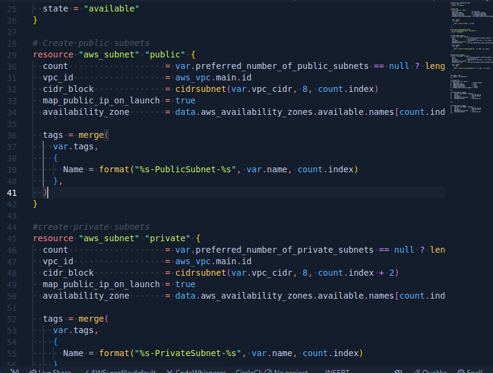
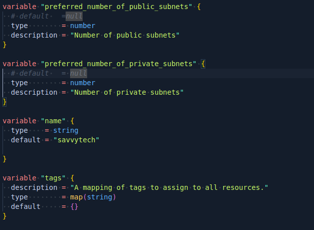

# AUTOMATE-INFRASTRUCTURE-WITH-IAC-USING-TERRAFORM-PART-2
--------
### Networking - Private subnets & best practices

* Create 4 private subnets keeping in mind following principles:
    * Make sure you use variables or length() function to determine the number of AZs.
    * Use variables and cidrsubnet() function to allocate vpc_cidr for subnets.
    * Keep variables and resources in separate files for better code structure and readability.
    * Tag all the resources you have created so far. Explore how to use format() and count functions to automatically tag subnets with its respective number.

Note: You can add multiple tags as a default set. for example, in out terraform.tfvars file we can have default tags defined.

    tags = {
    Enviroment      = "production" 
    Owner-Email     = "savvy@savvytech.io"
    Managed-By      = "Abdul"
    Billing-Account = "1234567890"
    }

Now you can tag all you resources using the format below

    tags = merge(
        var.tags,
        {
        Name = "Name of the resource"
        },
    )

NOTE: Update the variables.tf to declare the variable tags used in the format above;

    variable "name" {
    type    = string
    default = "savvytech"
    }

    variable "tags" {
    description = "A mapping of tags to assign to all resources."
    type        = map(string)
    default     = {}
    }

 

Anytime we need to make a change to the tags, we simply do that in one single place (terraform.tfvars). But, our key-value pairs are hard coded. So, go ahead and work out a fix for that. Simply create variables for each value and use var.variable_name as the value to each of the keys.

### Internet Gateways & format() function

* Create an Internet Gateway in a separate Terraform file internet_gateway.tf

